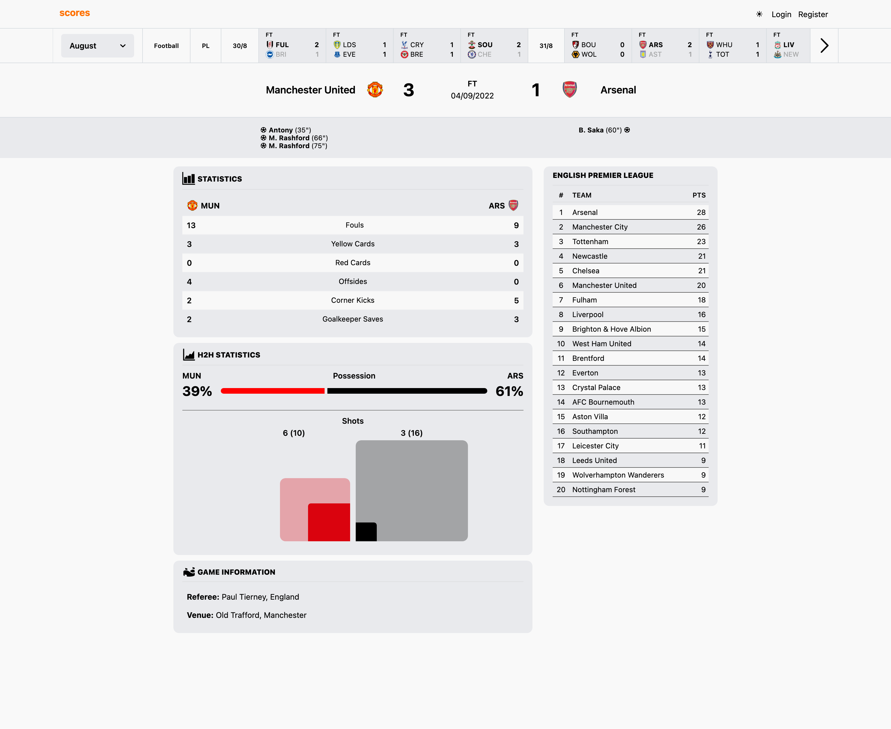
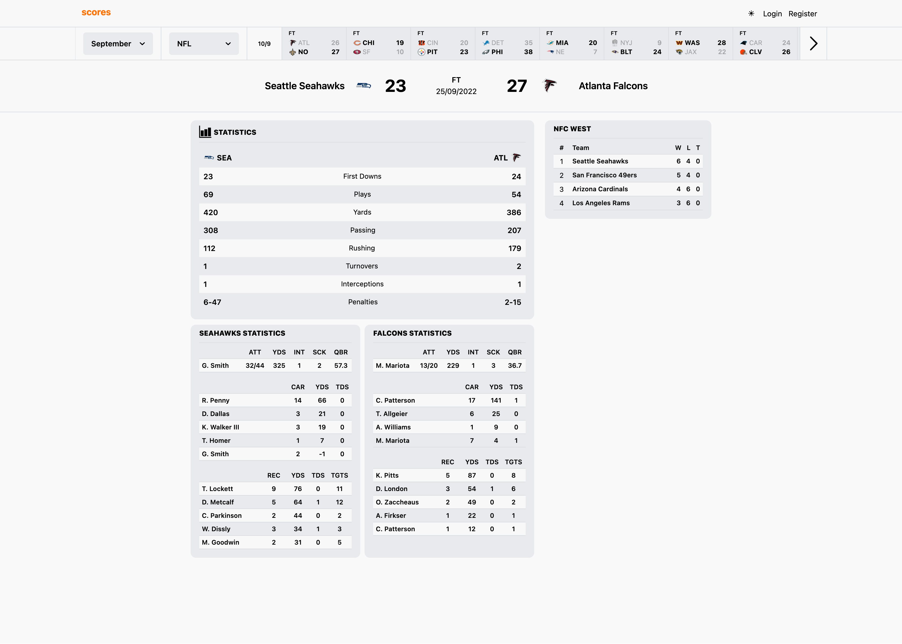
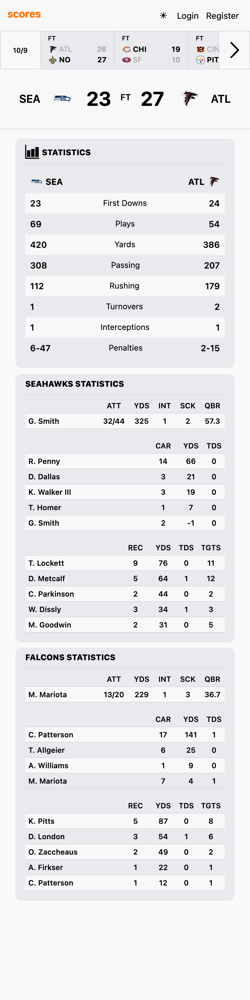
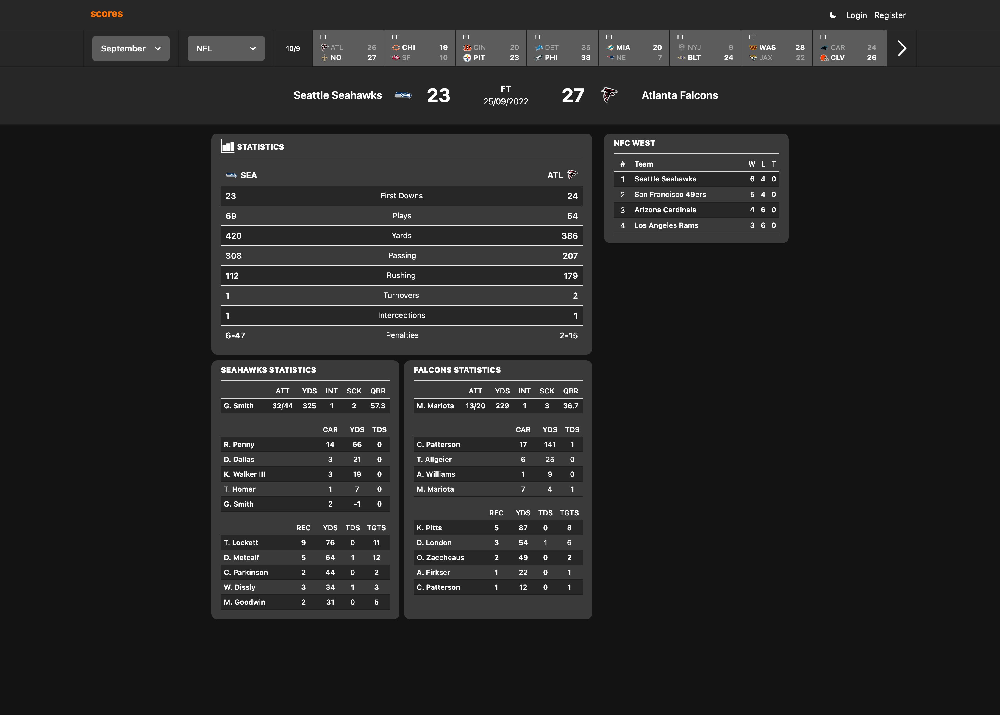
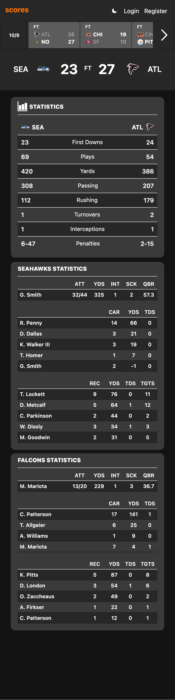

# @scores

Scores tracking application built to be cross platform with React Native.

### UI:

Desktop                    |  Desktop Mobile
:-------------------------:|:-------------------------:
 | 

Desktop (Dark)             |  Desktop Mobile (Dark)
:-------------------------:|:-------------------------:
 | 

| Scores Carousel - supporting multiple sports scoring |
:-------------------------:|
| Football
 |
| NFL
   |

Mobile                     |  Mobile (Dark)
:-------------------------:|:-------------------------:
 | 

Fixture Desktop                     |  Fixture Mobile
:-------------------------:|:-------------------------:
 | 

Fixture Desktop (NFL / Light)             |  Fixture Mobile (NFL / Light)
:-------------------------:|:-------------------------:
 | 

Fixture Desktop (Dark)             |  Fixture Mobile (Dark)
:-------------------------:|:-------------------------:
 | 

Fixture Desktop (NFL / Dark)             |  Fixture Mobile (NFL / Dark)
:-------------------------:|:-------------------------:
 | 

#### iOS

As part of the Native process, we also have custom widgets (heavily WIP): 

Widget                     |  Widget (Dark)
:-------------------------:|:-------------------------:
 | 

## Setup:

```
yarn
```

Then setup the monorepo:

```
lerna bootstrap
```

### Services:

To run an individual service use:

```
yarn run api:start:dev
yarn run web:start:dev
```

### Assistance

To add a new package, from the root directory:

```
lerna add <package> --scope=<service/package> [--scope=c --scope=d]
```

E.g.

```
lerna add @scores/ui --scope=@scores/web --dev
```

Or try:

```
yarn workspace @scores/expo add react-devtools@4.22.0 --dev
```

To remove an existing package:

1. Remove it from the local package/service
2. Run the below

```
lerna bootstrap --scope=<service/package> --no-ci --force-local
```

## Documentation

To generate the dependency graph seen above, run:

```
npx graph
```

## Known Issues

Whilst updating packages, there seems to be a bug in Yarn which requires the use of a downgraded `yarn` if you see `error An unexpected error occurred: "expected workspace package to exist for \"@react-native-community/cli-platform-android\"".
` just do:

```
npx yarn@1.19.0 add <your packages>
```